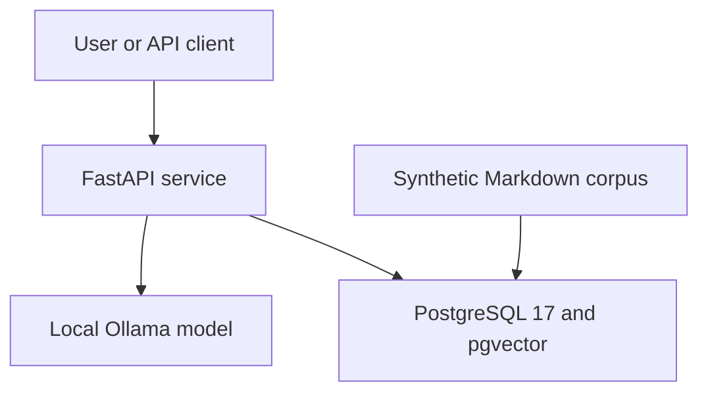
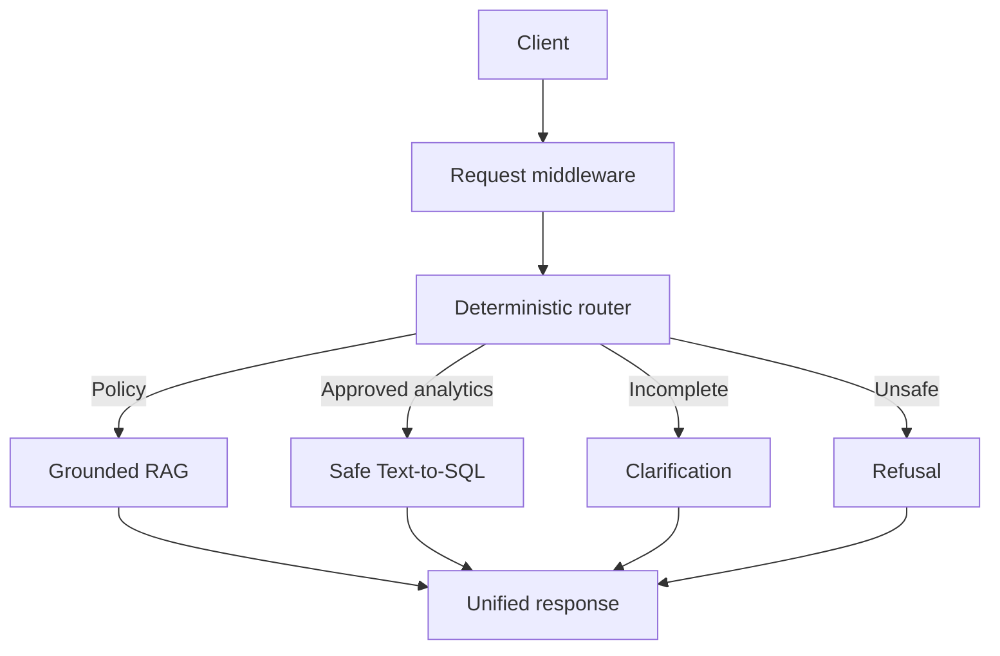
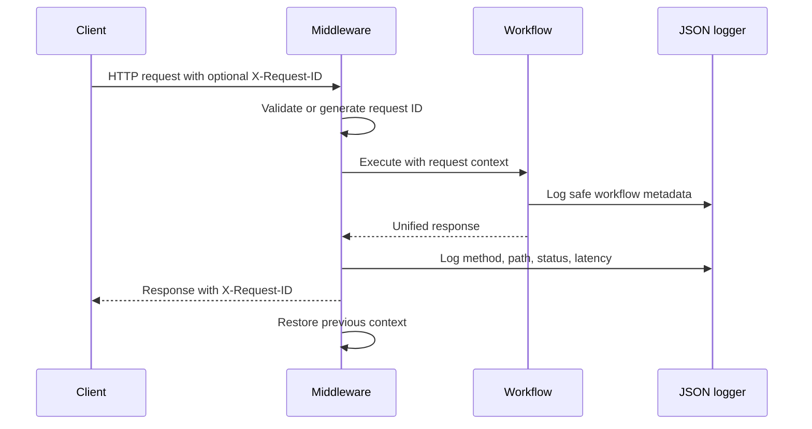
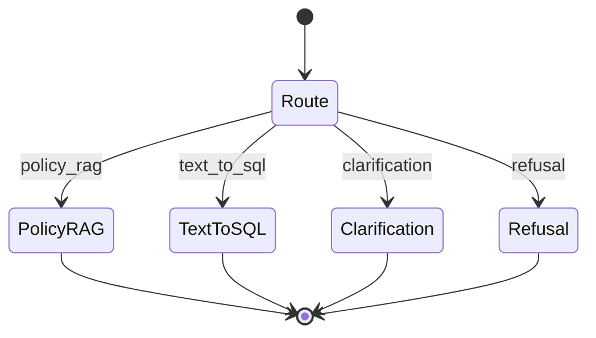
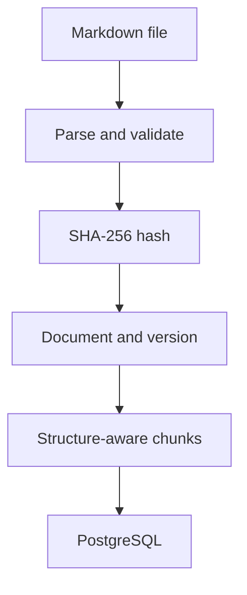
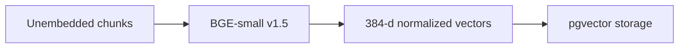
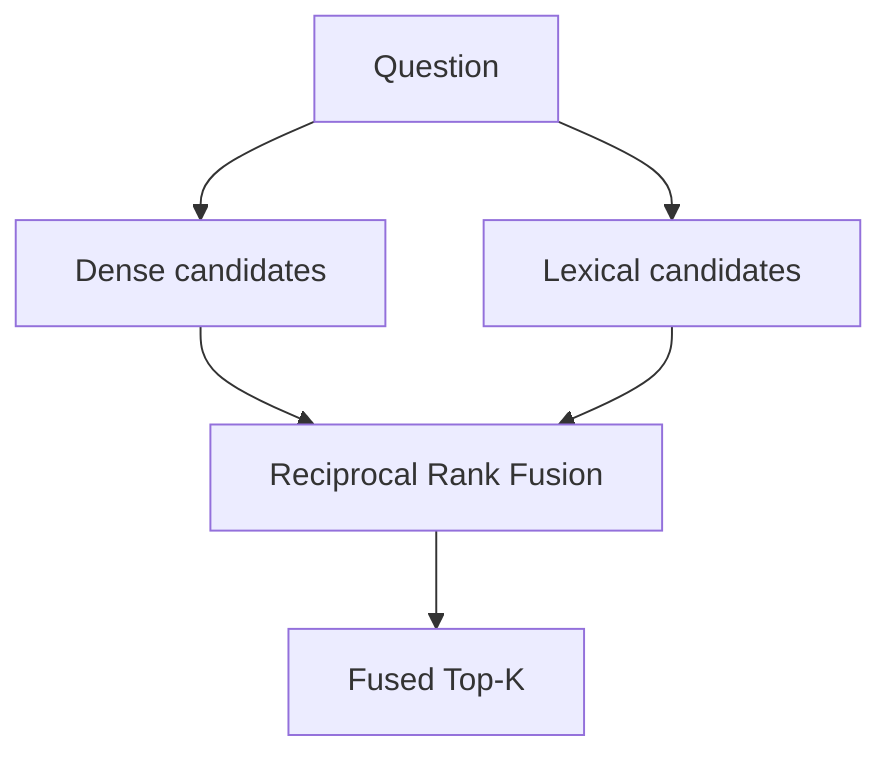
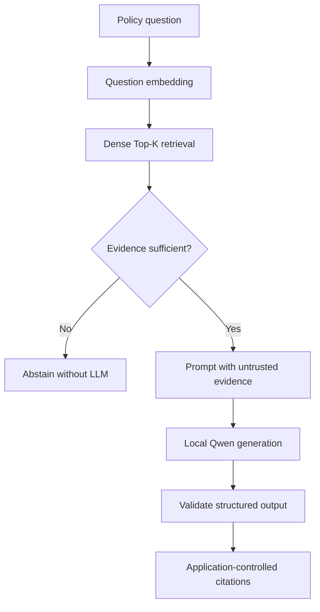
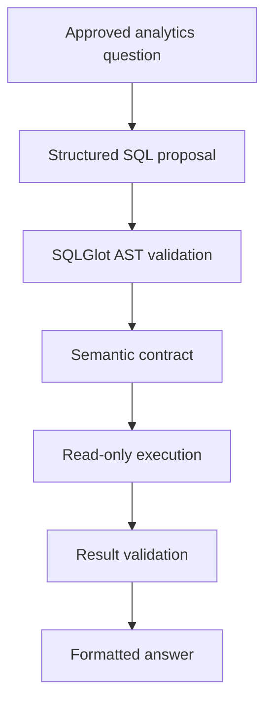

# System Architecture

Last updated: 2026-09-18

## Purpose

The Enterprise Knowledge and Analytics Agent provides one controlled interface for
questions over two different information sources:

- Unstructured enterprise policy documents.
- Structured synthetic expense data.

The system routes requests to grounded RAG, safe Text-to-SQL, clarification, or
refusal. It is designed as a portfolio-scale local system with explicit safety
boundaries, deterministic evaluation, and reproducible execution.

It is not designed or represented as a production deployment.

## Architectural principles

The implementation follows these principles:

1. **Deterministic routing before model execution.**
2. **Treat retrieved content as untrusted evidence.**
3. **Validate generated SQL before database execution.**
4. **Enforce database permissions independently of application checks.**
5. **Avoid LLM calls when clarification, refusal, or abstention is sufficient.**
6. **Return structured, validated response models.**
7. **Record only safe operational metadata in logs.**
8. **Separate measured capabilities from planned architecture.**

## System context

The application runs locally through Python and `uv`. Docker Compose currently runs
only PostgreSQL/pgvector. Ollama runs as a separate local service.

## High-level request architecture

The graph does not select arbitrary tools. Each route is mapped to a specific,
application-controlled node.

## Main components

| Component | Responsibility |
|---|---|
| `api` | HTTP validation, dependency injection, request IDs, response models, and request logging |
| `workflow` | Deterministic routing and LangGraph orchestration |
| `rag` | Evidence-threshold decisions, prompt construction, generation, and citations |
| `analytics` | Analytics routing, SQL proposal validation, execution, and result formatting |
| `retrieval` | Embeddings, exact dense search, lexical search, and RRF fusion |
| `ingestion` | Markdown validation, hashing, identity extraction, and persistence |
| `processing` | Structure-aware chunk generation |
| `evaluation` | Golden-dataset loading and retrieval/RAG metrics |
| `persistence` | Database engine, SQLAlchemy models, and synthetic analytics seed |
| `observability` | JSON formatting and request-context management |

## API boundary

The FastAPI application exposes:

| Method | Path | Purpose |
|---|---|---|
| `GET` | `/health` | Confirm that the API process is running |
| `GET` | `/ready` | Confirm that PostgreSQL is reachable |
| `POST` | `/api/v1/questions` | Run a question through the controlled workflow |

Question requests use a strict Pydantic model:

- The `question` field is required.
- Empty questions are rejected.
- Questions are limited to 2,000 characters.
- Unexpected fields are rejected.

The unified workflow response may contain:

- Selected route.
- Natural-language answer.
- Abstention status.
- Policy citations.
- Validated SQL and safe aggregate rows.
- Retrieval score.
- Model identity.
- Token counts.
- Total latency.

Fields that do not apply to a route remain empty or `null`.

## Request context and observability

A safe caller-supplied request ID is preserved. Missing or unsafe values are replaced.

Operational logs include:

- Event name.
- Request ID.
- Method and path.
- Status code.
- Route.
- Outcome and abstention.
- Model identity.
- Prompt and completion tokens.
- Retrieval top score.
- Latency.

Logs intentionally omit:

- Raw user questions.
- Generated SQL.
- Query result rows.
- Retrieved evidence text.
- Credentials.
- Database connection strings.

## Deterministic routing

The routing layer classifies requests using controlled application rules.

| Route | Trigger |
|---|---|
| `policy_rag` | Supported policy-style questions |
| `text_to_sql` | The explicitly approved Engineering analytics question |
| `clarification` | Incomplete or ambiguous analytics questions |
| `refusal` | Destructive operations or restricted employee-level requests |

Examples:

| Question | Route |
|---|---|
| “How many weeks of paid parental leave are available?” | `policy_rag` |
| “How much did Engineering spend on paid expense reports in 2025?” | `text_to_sql` |
| “How much did Sales spend?” | `clarification` |
| “Delete all expense records older than two years.” | `refusal` |

The router is intentionally not LLM-based. This makes its current scope predictable,
testable, and inexpensive.

## LangGraph orchestration

The workflow uses a typed LangGraph `StateGraph`.

LangGraph provides:

- Explicit state transitions.
- Typed shared workflow state.
- Separate execution nodes.
- A single compiled workflow interface.
- Testable branch behavior.

LangGraph does not provide the RAG or SQL safety guarantees. Those remain enforced by
the called services and PostgreSQL.

The graph is currently compiled per workflow invocation. Persistent checkpoints and
conversation memory are intentionally deferred.

## Document ingestion pipeline

The ingestion pipeline:

1. Reads one Markdown document.
2. Extracts and validates its document identifier.
3. Calculates a SHA-256 content hash.
4. Checks whether the same document content is already active.
5. Creates a new document version only when content changed.
6. Produces chunks that retain document and section lineage.
7. Persists the version and chunks transactionally.

This provides deterministic identity, version history, and unchanged-document
idempotency.

Current verified scope:

- Six Markdown documents.
- 35 chunks.
- Markdown only.

## Embedding pipeline

`BAAI/bge-small-en-v1.5` creates normalized 384-dimensional embeddings.

Embedding generation:

- Selects stored chunks without the target embedding.
- Generates normalized vectors.
- Persists vectors with model metadata.
- Avoids duplicating existing embeddings.

## Retrieval architecture

Three retrieval implementations are available.

### Exact dense retrieval

1. Embed the question with the same BGE model.
2. Compare it with stored chunk embeddings.
3. Rank active chunks by cosine similarity.
4. Return the requested Top-K evidence.

### PostgreSQL lexical retrieval

1. Convert the question to PostgreSQL full-text search terms.
2. Match the generated chunk `tsvector`.
3. Rank active chunks using PostgreSQL text-search ranking.
4. Return the requested Top-K results.

### RRF hybrid retrieval

1. Retrieve up to ten dense candidates.
2. Retrieve up to ten lexical candidates.
3. Rank each list independently.
4. Fuse ranks using Reciprocal Rank Fusion.
5. Deduplicate by chunk ID.
6. Return the final Top-K results.

RRF combines ranks rather than directly comparing incompatible cosine and lexical
scores.

Hybrid retrieval is evaluated offline. The API RAG path currently uses dense
retrieval because its abstention decision depends on a calibrated cosine threshold.

## Grounded RAG pipeline

The RAG service:

1. Retrieves Top-K active chunks.
2. Reads the top dense similarity score.
3. Abstains when the score is below the provisional `0.70` threshold.
4. Avoids calling the LLM during abstention.
5. Labels retrieved content as untrusted evidence.
6. Requests structured output containing an answer and citation ranks.
7. Validates the structured model response.
8. Maps valid ranks to citations controlled by the application.

The model does not construct document identities or citation metadata.

## Safe Text-to-SQL pipeline

### Generation boundary

The model receives:

- An approved schema description.
- A narrow approved question.
- A required result contract.
- Instructions to return one JSON object containing SQL.

The model never receives restricted values such as salaries or email addresses.

### General SQL validation

SQLGlot parses the proposal as PostgreSQL and verifies:

- Exactly one statement.
- A `SELECT` root node.
- No CTEs.
- No subqueries.
- No wildcards.
- No locking.
- No `SELECT INTO`.
- Only the `analytics` schema.
- Only allowlisted tables and columns.
- No restricted columns.
- No unknown functions.
- A valid bounded result limit.

A missing limit is replaced with `LIMIT 100`.

### Semantic validation

The approved Engineering operation additionally requires:

- `departments`
- `employees`
- `expense_reports`
- `expense_items`
- `Engineering`
- `paid`
- `2025-01-01`
- `2026-01-01`
- Date filtering through `expense_reports.submitted_date`
- `COUNT(DISTINCT expense_reports.id)` as `report_count`
- `SUM(expense_items.amount)` as `total_usd`
- `departments.name` as `department`
- Department grouping

This prevents syntactically safe but semantically incorrect SQL from executing.

### Database execution boundary

Validated SQL executes with defense in depth:

1. Begin a transaction.
2. Set the transaction to read-only.
3. Assume `enterprise_agent_analytics_reader`.
4. Set a three-second statement timeout.
5. Execute the validated statement.
6. Convert rows to the application result type.
7. Roll back the transaction.

The database role cannot write analytics data or access restricted salary data.

### Result boundary

The application validates:

- Exactly one result row.
- Department equals `Engineering`.
- Report count is an integer.
- Total is a decimal monetary value.

Only then is the natural-language answer formatted.

## Database architecture

The database contains two schemas.

### `public`

| Table | Purpose |
|---|---|
| `documents` | Stable document identity |
| `document_versions` | Versioned document content and hashes |
| `processing_runs` | Processing lineage |
| `chunks` | Structured document chunks and full-text vector |
| `embeddings` | pgvector embeddings and model metadata |
| `evaluation_runs` | Evaluation persistence foundation |

### `analytics`

| Table | Purpose |
|---|---|
| `departments` | Fictional organizational departments |
| `employees` | Synthetic employees with protected fields |
| `expense_reports` | Report metadata and status |
| `expense_items` | Individual expense amounts and categories |

The administrative connection performs migrations and data preparation. Generated
analytics queries execute after assuming the restricted reader role.

## Evaluation architecture

Evaluation is deterministic and dataset-driven.

### Retrieval metrics

For each answerable case, the evaluator compares retrieved evidence with expected
document and section identifiers.

Metrics include:

- Hit Rate@K.
- Recall@K.
- Precision@K.
- Mean Reciprocal Rank.

### RAG control metrics

The deterministic RAG evaluation records:

- Supported-answer rate.
- Unsupported abstention rate.
- Citation hit rate.
- Complete citation recall.
- LLM-call behavior.
- Latency.

Deterministic providers isolate application control behavior from real-model language
variation.

Selected cases are also exercised manually with the real local Qwen model.

## Testing architecture

The project separates deterministic and integration testing.

### Deterministic tests

These cover:

- Configuration.
- Domain validation.
- Markdown parsing.
- Chunking.
- Retrieval fusion.
- Evaluation metrics.
- Analytics routing.
- SQL AST safety.
- Workflow routing.
- Non-executing graph branches.
- Structured logging.
- Request-ID behavior.

They do not require a running PostgreSQL or Ollama service.

### Integration tests

These use real local PostgreSQL for:

- Migrations and schema verification.
- Reader-role permissions.
- Ingestion persistence.
- Embedding storage.
- Dense and lexical retrieval.
- Hybrid retrieval.
- Grounded RAG execution boundaries.
- Safe SQL execution.
- Text-to-SQL integration.
- LangGraph executing branches.
- FastAPI behavior.

Real Ollama calls are demonstrated manually; automated integration tests use
deterministic model providers.

## Continuous integration architecture

GitHub Actions runs a service-free deterministic quality job:

1. Check out the repository.
2. Install pinned `uv`.
3. Install Python 3.12.
4. Synchronize locked dependencies.
5. Run Ruff lint.
6. Verify Ruff formatting.
7. Run Pyright strict checks.
8. Run non-integration tests with coverage.
9. Prune the CI cache.

The test step receives a non-connecting placeholder database URL because selected
non-integration tests construct an SQLAlchemy engine while verifying that their routes
do not perform database operations.

The complete PostgreSQL integration suite remains part of the local quality gate.

## Trust boundaries

The main trust boundaries are:

| Boundary | Untrusted input | Control |
|---|---|---|
| HTTP request | User JSON and request ID | Pydantic validation and request-ID normalization |
| Routing | User question | Deterministic allowlist rules |
| Retrieval | Stored document content | Evidence treated as untrusted data |
| Model output | Generated JSON and SQL | Pydantic and SQLGlot validation |
| SQL semantics | Syntactically safe but wrong SQL | Operation-specific semantic contract |
| Database | Validated query | Reader role, read-only transaction, timeout |
| Result | Database-returned shape | Application result validation |
| Logs | Operational values | Explicit safe-field selection |

## Deliberate architectural boundaries

The following are intentionally outside the verified architecture:

- Autonomous planning.
- Dynamic tool selection.
- Multi-agent collaboration.
- Persistent conversation memory.
- Persistent LangGraph checkpoints.
- External tracing.
- Authentication and authorization.
- Rate limiting.
- PDF or Office ingestion.
- OCR and table extraction.
- Cross-encoder reranking.
- MLflow.
- Application containerization.
- Cloud deployment.
- Kubernetes.
- Load testing.

These can be considered future extensions, but they are not required to demonstrate
the current portfolio concepts.

## Known architectural trade-offs

### Deterministic routing versus LLM routing

Deterministic routing is narrower but predictable, inexpensive, auditable, and easily
tested. An LLM router would support broader language variation but introduce additional
model failure modes and require a routing evaluation dataset.

### Exact dense retrieval versus approximate indexing

Exact search is appropriate for the current 35-chunk corpus and produces reproducible
results. Approximate indexes become useful at larger scale but introduce tuning and
recall trade-offs that this corpus cannot meaningfully evaluate.

### Dense API path versus hybrid API path

Dense retrieval provides a cosine score used by the current abstention policy. Hybrid
retrieval improves evidence coverage, but RRF scores are rank-based and require a
separate abstention calibration before safe API integration.

### Narrow Text-to-SQL versus general Text-to-SQL

The narrow operation supports strong semantic validation and defensible safety claims.
General Text-to-SQL would require broader intent classification, schema linking,
semantic policies, evaluation coverage, and additional authorization controls.

### Local services versus cloud deployment

Local PostgreSQL and Ollama make the system reproducible without cloud cost or
credential management. They do not demonstrate production availability, scaling, or
managed-service operations.

## Related documentation

- [Project README](../../README.md)
- [Security and limitations](../security/security-and-limitations.md)
- [PostgreSQL and pgvector ADR](../adr/0001-postgresql-pgvector.md)
- [Domain specification](../domain/domain-specification.md)
- [Project progress](../progress/project-progress.md)
- [Verified achievements](../progress/verified-achievements.md)