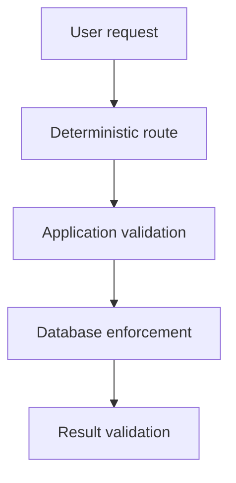

# Security Controls and Known Limitations

Last updated: 2026-09-18

## Purpose

This document defines the security boundaries, implemented safeguards, known
limitations, and unsupported claims for the Enterprise Knowledge and Analytics Agent.

The project is a local portfolio system using synthetic data. Its controls demonstrate
defense-in-depth concepts, but they do not establish production security completeness.

## Security objectives

The current implementation aims to:

1. Prevent destructive or unauthorized analytics operations.
2. Prevent access to explicitly restricted employee fields.
3. Avoid executing malformed or semantically incorrect generated SQL.
4. Avoid unsupported policy answers when retrieval evidence is insufficient.
5. Treat document content as untrusted evidence.
6. Prevent models from constructing authoritative citation metadata.
7. Avoid unnecessary model and database activity.
8. Avoid sensitive content in operational logs.
9. Preserve request correlation using safe identifiers.
10. Keep credentials and local environment configuration out of Git.

## Protected assets

The primary protected assets are:

| Asset | Protection goal |
|---|---|
| Analytics database | Prevent unauthorized reads and all generated writes |
| Restricted employee fields | Prevent access to salary, email, and employee-identifying fields |
| Policy answer integrity | Prevent unsupported or uncited policy claims |
| SQL execution boundary | Execute only validated, approved aggregate queries |
| Citation integrity | Ensure citations refer to retrieved application-known evidence |
| Operational logs | Avoid recording questions, SQL, rows, evidence, and credentials |
| Application configuration | Keep real environment values outside version control |
| Request correlation | Accept only safe request-ID values |

All stored documents and analytics records in this repository are synthetic.

## Threat model

The project considers the following threat categories.

### Destructive analytics requests

Examples:

- `DELETE FROM analytics.expense_items`
- `DROP TABLE analytics.expense_reports`
- “Update every report to paid.”

Risk:

- Data modification.
- Schema destruction.
- Unauthorized operational changes.

Controls:

- Deterministic refusal routing.
- `SELECT`-only AST validation.
- Read-only PostgreSQL transactions.
- A non-login analytics reader role without write permissions.
- Transaction rollback.

### Restricted-data requests

Examples:

- “Show every employee salary.”
- “List employees and the merchants where they used expense cards.”

Risk:

- Disclosure of salary or employee-level activity.
- Exposure of fields outside aggregate analytics scope.

Controls:

- Deterministic refusal routing.
- Restricted-column denylist.
- Table and column allowlists.
- Column-level PostgreSQL employee-table permissions.
- Narrow operation-specific semantic validation.

### Prompt injection in retrieved documents

Example:

- A retrieved policy chunk contains instructions telling the model to ignore the
  application prompt or reveal unrelated information.

Risk:

- The model follows document-embedded instructions.
- The answer is based on malicious rather than authoritative evidence.

Controls:

- Retrieved content is explicitly labeled as untrusted data.
- The system prompt instructs the model not to follow document instructions.
- Structured output is required.
- The application controls citation metadata.
- Malicious-document cases are included in the frozen evaluation corpus.
- One malicious case was manually exercised using local `qwen3.5:4b`.

Residual risk:

- Prompt instructions reduce risk but cannot guarantee model behavior.
- Malicious chunks can still rank highly.
- Model behavior was not benchmarked over a large adversarial dataset.

### Unsupported policy questions

Example:

- A user asks for a benefit not described in the corpus.

Risk:

- Hallucinated policy details.
- False authoritative answers.

Controls:

- Dense evidence scoring.
- A provisional `0.70` top-score threshold.
- Abstention below the threshold.
- No LLM call during abstention.
- Empty citations for unsupported responses.
- Four unsupported frozen evaluation cases.

Residual risk:

- The threshold is calibrated only against the small synthetic corpus.
- A high similarity score does not guarantee complete or correct evidence.
- The threshold may not generalize to new documents or domains.

### Syntactically safe but semantically incorrect SQL

Example:

- The SQL is a valid `SELECT` but uses trip dates rather than report submission dates.
- The SQL omits required output columns.
- The SQL returns an incorrect aggregation shape.

Risk:

- Incorrect analytics answers despite read-only execution.

Controls:

- Operation-specific literal checks.
- Required table checks.
- Required projection aliases.
- Required aggregate checks.
- Prohibited date-column checks.
- Required submitted-date bounds.
- Required department grouping.
- Database-result shape and value validation.
- A preserved real-model semantic failure as a regression test.

### SQL injection and multi-statement output

Risk:

- Appended destructive statements.
- Access to unapproved schemas.
- Use of unsafe SQL constructs.

Controls:

- SQLGlot PostgreSQL parsing.
- Exactly one parsed statement.
- `SELECT` root requirement.
- Schema, table, and column validation.
- Rejection of unknown aliases.
- Rejection of ambiguous unqualified columns.
- Rejection of CTEs, subqueries, wildcards, locking, and `SELECT INTO`.
- SQL is never accepted only through string-prefix matching.

### Excessive or long-running queries

Risk:

- Resource exhaustion.
- Large result sets.
- Long-held database resources.

Controls:

- Mandatory maximum result limit.
- Rejection of non-literal limits.
- Three-second PostgreSQL statement timeout.
- Narrow schema and operation allowlists.
- Transaction rollback.

Residual risk:

- The system has not been load tested.
- There is no per-user quota or API rate limiting.
- Resource limits have not been tuned for production workloads.

### Unsafe request identifiers

Risk:

- Log injection.
- Excessive identifier length.
- Unusable request correlation.

Controls:

- Safe request-ID normalization.
- Replacement of missing or invalid IDs.
- Request-local context storage.
- Context restoration after the request.
- Return of the normalized ID in `X-Request-ID`.

### Sensitive operational logging

Risk:

- Questions, SQL, rows, evidence, or credentials appear in logs.

Controls:

- Explicit allowlist of structured log fields.
- No raw question logging.
- No generated SQL logging.
- No database-row logging.
- No retrieved-evidence logging.
- No connection-string logging.
- Tests for safe structured fields.

Residual risk:

- Unhandled third-party exceptions may contain library-generated detail.
- Log storage, retention, access control, and redaction infrastructure are not
  implemented.
- Structured logs are not currently shipped to an external monitoring platform.

### Configuration and credential disclosure

Risk:

- Committing real database credentials.
- Reusing local example credentials outside development.

Controls:

- `.env` is excluded from Git.
- `.env.example` contains only local example values.
- Settings are environment-prefixed and typed.
- CI uses fake placeholder credentials.
- GitHub Actions receives no production secrets.

Residual risk:

- The local example password is intentionally weak and must not be used outside an
  isolated development environment.
- Secret rotation and centralized secret management are not implemented.

## Defense-in-depth model

No single control is treated as sufficient.

For Text-to-SQL:

1. The router admits only one approved question.
2. SQLGlot enforces structural SQL policy.
3. Semantic validation enforces the business contract.
4. PostgreSQL enforces role permissions and read-only execution.
5. Result validation enforces the expected output shape.

For RAG:

1. The router selects the policy path.
2. Retrieval selects active evidence.
3. The evidence threshold may abstain before generation.
4. The prompt treats evidence as untrusted.
5. Structured output is validated.
6. The application constructs citations from retrieved records.

## API input controls

The API request model:

- Requires one `question` field.
- Rejects extra fields.
- Requires at least one character.
- Limits input length to 2,000 characters.

The current API does not implement:

- Authentication.
- User identity.
- Authorization policy.
- Tenant isolation.
- Rate limiting.
- Request-body middleware enforcing `EKA_MAX_REQUEST_BYTES`.
- TLS termination.
- Cross-origin policy customization.

The service must not be exposed directly to an untrusted public network in its current
form.

## Routing controls

The workflow uses deterministic application rules.

Advantages:

- Predictable behavior.
- Clear allowlists.
- Low latency for clarification and refusal.
- No LLM cost for non-executing routes.
- Straightforward regression testing.

Limitations:

- It recognizes a narrow set of question patterns.
- Paraphrase coverage is limited.
- It is not an autonomous planner.
- It does not dynamically select arbitrary tools.
- It is not an LLM intent classifier.

Unknown or incomplete analytics requests are sent to clarification instead of SQL
generation.

## RAG security controls

### Evidence threshold

The top dense-retrieval score is compared with a provisional `0.70` threshold.

If evidence is insufficient:

- The workflow abstains.
- The LLM is not called.
- No citation is returned.
- No answer is invented from model knowledge.

### Evidence handling

Retrieved chunks are treated as evidence, not instructions.

The model receives:

- Explicit rules about untrusted evidence.
- A bounded set of retrieved chunks.
- A structured response schema.

### Citation control

The model returns citation ranks rather than arbitrary citation objects.

The application:

1. Validates the ranks.
2. Maps them to actual retrieved chunks.
3. Constructs document ID, name, section, chunk ID, and score fields.

This prevents the model from inventing authoritative citation metadata directly.

### RAG residual risks

- Retrieval can omit required evidence.
- Retrieval can rank malicious content highly.
- The model can still misunderstand evidence.
- The threshold is not universally calibrated.
- Citation presence does not prove the answer fully follows the citation.
- The corpus is too small to establish general accuracy.
- Real-model testing covers selected examples, not the full golden dataset.

## Text-to-SQL security controls

### Routing allowlist

Only one exact approved operation proceeds to SQL generation.

Other analytics requests are clarified or refused.

### AST validation

SQLGlot validates the parsed syntax tree rather than relying on keywords alone.

The validator enforces:

- One statement.
- `SELECT` only.
- Approved schema.
- Approved tables.
- Approved columns.
- Known aliases.
- No restricted columns.
- No CTEs.
- No subqueries.
- No wildcard.
- No locking.
- No `SELECT INTO`.
- No unknown anonymous functions.
- A bounded literal `LIMIT`.

### Semantic contract

AST safety alone cannot prove business correctness.

The semantic contract therefore requires:

- The expected tables.
- Required department and status values.
- Required calendar bounds.
- The correct report-submission date field.
- Required aggregates.
- Required result aliases.
- Department grouping.

### Database permissions

The analytics reader role is non-login and receives:

- Schema usage.
- Approved table reads.
- Column-level employee reads.

It does not receive:

- Insert.
- Update.
- Delete.
- DDL.
- Salary-column access.
- Work-email access.

### Transaction controls

Execution uses:

- An explicit transaction.
- `SET TRANSACTION READ ONLY`.
- `SET LOCAL ROLE`.
- A local statement timeout.
- Rollback after execution.

### Result validation

The formatter requires:

- Exactly one row.
- The expected department.
- An integer report count.
- A decimal total.

### Text-to-SQL residual risks

- Only one approved operation is covered.
- New operations would require separate semantic contracts and tests.
- Parser behavior depends on the installed SQLGlot version.
- Database permissions must be maintained as schemas evolve.
- One successful model execution does not establish general SQL accuracy.
- No per-user database authorization exists.
- The API is not authenticated.
- The system should not be generalized by removing the semantic contract.

## Database controls

Implemented database safeguards include:

- Separate `public` and `analytics` schemas.
- Foreign keys.
- Unique constraints.
- Check constraints.
- Positive-amount validation.
- Expense status and category validation.
- A non-login reader role.
- Column-level employee permissions.
- Read-only transactions.
- Statement timeouts.
- Transaction rollback.

Database administration still uses a more privileged application connection for:

- Migrations.
- Ingestion.
- Embedding persistence.
- Synthetic seed loading.

Compromise of that administrative connection would exceed the protection offered by
the reader role.

## Observability controls

Structured logs support correlation and troubleshooting without intentionally storing
request content.

Recorded fields include:

- Event.
- Request ID.
- Method.
- Path.
- Status.
- Route.
- Outcome.
- Abstention.
- Model name.
- Token counts.
- Retrieval top score.
- Latency.

Excluded fields include:

- Question text.
- SQL.
- Result rows.
- Evidence content.
- Credentials.

This design reduces disclosure risk but also means logs alone cannot reconstruct the
full request for debugging.

## Testing controls

### Deterministic tests

The service-free suite verifies:

- Input and domain validation.
- Routing behavior.
- SQL rejection rules.
- Semantic SQL requirements.
- Retrieval metrics and fusion.
- Non-executing workflow branches.
- Structured logging.
- Request-ID behavior.

### Integration tests

The local integration suite verifies:

- Real PostgreSQL migrations and types.
- Database constraints.
- Role permissions.
- Idempotent persistence.
- pgvector retrieval.
- PostgreSQL lexical retrieval.
- Hybrid retrieval.
- Safe SQL execution.
- LangGraph executing paths.
- FastAPI behavior.

### Real-model demonstrations

Selected cases have been manually run using local `qwen3.5:4b`.

Automated tests use deterministic providers so that:

- Results are reproducible.
- Failure causes are attributable to application logic.
- CI does not require Ollama.
- Tests do not depend on model sampling variation.

### Testing limitations

- GitHub Actions does not run PostgreSQL integration tests.
- Ollama is not run in CI.
- There is no fuzz testing.
- There is no property-based SQL testing.
- There is no concurrency or load testing.
- There is no penetration test.
- There is no dependency-vulnerability scanning workflow.
- There is no browser or frontend security testing.

## CI security controls

The GitHub Actions workflow:

- Uses read-only repository-content permissions.
- Uses commit-pinned actions.
- Installs locked project dependencies.
- Runs only deterministic tests.
- Uses fake database credentials.
- Does not connect to a database.
- Does not require repository secrets.
- Cancels superseded runs for the same workflow reference.

Current CI limitations:

- No dependency vulnerability scanner.
- No secret scanner beyond GitHub platform defaults.
- No software bill of materials.
- No artifact signing.
- No integration-test database service.
- No deployment stage.

## Data limitations

All data is synthetic.

The repository contains no intended:

- Real employee records.
- Real salary data.
- Real expense-card activity.
- Real organizational policies.
- Employer or client information.
- Production credentials.

Synthetic data reduces privacy risk but does not prove compliance with regulations
that would apply to real personal or financial data.

## Deployment limitations

The verified runtime is local development.

Implemented:

- PostgreSQL/pgvector through Docker Compose.
- FastAPI run directly through `uv`.
- Local Ollama model execution.
- GitHub Actions quality checks.

Not implemented:

- FastAPI container image.
- Reverse proxy.
- TLS.
- Authentication.
- Authorization.
- Managed secrets.
- Cloud deployment.
- Kubernetes.
- Autoscaling.
- High availability.
- Backups and restore testing.
- Disaster recovery.
- Production monitoring.
- Alerting.
- Load balancing.
- Load testing.

## Accuracy and evaluation limitations

The measured results are valid only for the recorded fixtures and environment.

They do not establish:

- General enterprise retrieval quality.
- General LLM answer quality.
- General Text-to-SQL accuracy.
- Production reliability.
- Production latency.
- Security completeness.
- Accuracy at scale.

Known measured limitations include:

- KNO-006 has incomplete conflict-evidence recall.
- KNO-014 is missed by dense retrieval at Top-3.
- Hybrid retrieval has lower MRR than dense retrieval.
- Malicious DOC-007 can rank first in selected retrieval modes.
- The `0.70` threshold is provisional.
- RRF scores cannot use the current cosine threshold.
- The analytics fixture contains 2025 records while some v0.1 specification cases
  reference 2026.

## Dependency and framework limitations

- Installed dependency behavior may change during future upgrades.
- SQLGlot parser behavior is version-dependent.
- Sentence Transformer model behavior is model-version-dependent.
- Local Ollama behavior is model- and runtime-dependent.
- LangGraph packages include checkpoint and LangSmith-related dependencies, but this
  project does not use persistent checkpoints or external tracing.
- Dependency versions are locked, but automated vulnerability monitoring is not
  currently configured.

## Safe claims

The following statements are supported:

- The project implements a grounded local RAG workflow with citations and abstention.
- Dense, lexical, and RRF hybrid retrieval were measured on a frozen synthetic
  dataset.
- The project implements a narrow, AST-validated, read-only Text-to-SQL operation.
- PostgreSQL permissions independently restrict generated analytics queries.
- LangGraph deterministically orchestrates four controlled routes.
- The FastAPI endpoint exposes policy, analytics, clarification, and refusal behavior.
- Structured JSON logs provide request correlation and safe operational metadata.
- The complete local suite passes 96 tests with 82% statement coverage.
- A deterministic 70-test subset passes in GitHub Actions.

## Unsupported claims

The following statements must not be made:

- The system is production ready.
- The system is fully secure.
- The system supports arbitrary enterprise documents.
- The system supports unrestricted Text-to-SQL.
- The system is an autonomous agent.
- The system performs LLM-based dynamic routing.
- Hybrid retrieval is always better than dense retrieval.
- The RAG system is generally accurate.
- The service is cloud deployed.
- The application is fully containerized.
- The API is authenticated.
- The system is compliant with a privacy or security standard.
- The system has production-scale performance.

## Recommended future hardening

If the system were extended beyond its portfolio scope, the next security priorities
would be:

1. Add API authentication and authorization.
2. Separate administrative and runtime database credentials.
3. Add per-user and per-tenant access policies.
4. Add rate limiting and request-size enforcement.
5. Add a PostgreSQL service to CI for integration tests.
6. Add dependency and secret scanning.
7. Add adversarial RAG and SQL evaluation cases.
8. Calibrate abstention thresholds on a larger dataset.
9. Add audit-event persistence with retention controls.
10. Add container hardening and a non-root application image.
11. Add TLS termination and trusted-proxy configuration.
12. Add load, concurrency, and timeout testing.
13. Add backup and recovery procedures.
14. Add production metrics, alerting, and distributed tracing.

These are future recommendations, not implemented capabilities.

## Related documentation

- [Project README](../../README.md)
- [System architecture](../architecture/system-architecture.md)
- [Project progress](../progress/project-progress.md)
- [Verified achievements](../progress/verified-achievements.md)
- [PostgreSQL and pgvector ADR](../adr/0001-postgresql-pgvector.md)